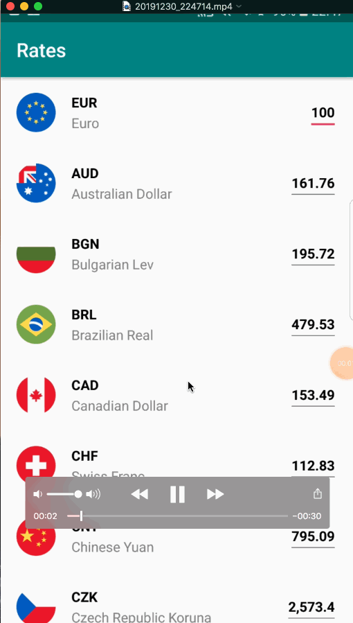

# Currency Rates & Convertion 
About 
-----
The app shows currency rates and converts rates. The data is updated every one second

Purpose 
-----
Experiment Kotlin and new technologies

Tech
-----
1. Kotlin + androidx
2. MVVM + data binding
3. Dagger2, DaggerAndroid
4. RxJava2, RxAndroid 
5. Retrofit
6. Moshi
